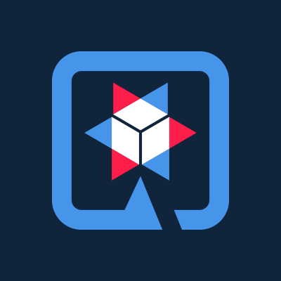

[![MIT License][license-shield]][license-url]

<!-- PROJECT LOGO -->
 

    
  

  <h3 align="center">Apresentação Framework Quarkus</h3>

  

    Supersônico e subatômico!
     
    
  

<!-- TABLE OF CONTENTS -->

  
Sumário

  <ol>
    <li>
      <a href="#sobre-o-quarkus">Sobre o Quarkus</a>
    </li>
    <li>
      <a href="#getting-started">Comparação entre Quarkus e SpringBoot</a>
      <ul>
        <li><a href="#prerequisites">Consumo de memória</a></li>
        <li><a href="#installation">Tempo de inicialização</a></li>
      </ul>
    </li>
    <li>
      <a href="#projetos-praticos">Projetos Práticos</a>
    </li>
  </ol>

<!-- ABOUT THE PROJECT -->
## Sobre o Quarkus

Um framework escrito em java feito pela Red Hat e Open Source. Sua principal vantagem é ter sido criado para fazer aplicações nativas para nuvem, pensando em microserviços. Exatamente pelo fato do baixo 
Uso de memória e tempo de inicialização reduzido.

Vantagens
* Baixo consumo de memória como citado anteriormente, em relação a outros frameworks.
* Rapida inicilização, o que torna um ótimo framework complementando o uso de ferramentas de orquestração

<!-- GETTING STARTED -->
## Comparação entre Quarkus e SpringBoot

O intuito desse projeto é apresentar, de forma prática, a comparação entre os dois frameworks e porque o Quarkus é tão promissor.

### Consumo de memória

Um comparativo no uso de memória de aplicações similares, em Quarkus e Spring Boot.

### Tempo de inicialização

Um comparativo do tempo de incialização de aplicações similares, em Quarkus e Spring Boot.

<!-- LICENSE -->
## License

Distribuido sobre a licença MIT. Veja a `LICENSE` para mais informações.

<!-- ACKNOWLEDGEMENTS -->
## Projetos Práticos
* [Projeto-Quarkus](https://github.com/mbebiano/quarkusxspring/tree/master/Projetos-Apresentacao/quarkus-mongo)
* [Projeto Spring](https://github.com/mbebiano/quarkusxspring/tree/master/Projetos-Apresentacao/springmongo)

<!-- MARKDOWN LINKS & IMAGES -->
<!-- https://www.markdownguide.org/basic-syntax/#reference-style-links -->
[contributors-shield]: https://img.shields.io/github/contributors/othneildrew/Best-README-Template.svg?style=for-the-badge
[contributors-url]: https://github.com/othneildrew/Best-README-Template/graphs/contributors
[forks-shield]: https://img.shields.io/github/forks/othneildrew/Best-README-Template.svg?style=for-the-badge
[forks-url]: https://github.com/othneildrew/Best-README-Template/network/members
[stars-shield]: https://img.shields.io/github/stars/othneildrew/Best-README-Template.svg?style=for-the-badge
[stars-url]: https://github.com/othneildrew/Best-README-Template/stargazers
[issues-shield]: https://img.shields.io/github/issues/othneildrew/Best-README-Template.svg?style=for-the-badge
[issues-url]: https://github.com/othneildrew/Best-README-Template/issues
[license-shield]: https://img.shields.io/github/license/othneildrew/Best-README-Template.svg?style=for-the-badge
[license-url]: https://github.com/othneildrew/Best-README-Template/blob/master/LICENSE.txt
[linkedin-shield]: https://img.shields.io/badge/-LinkedIn-black.svg?style=for-the-badge&logo=linkedin&colorB=555
[linkedin-url]: https://linkedin.com/in/othneildrew
[product-screenshot]: images/screenshot.png
